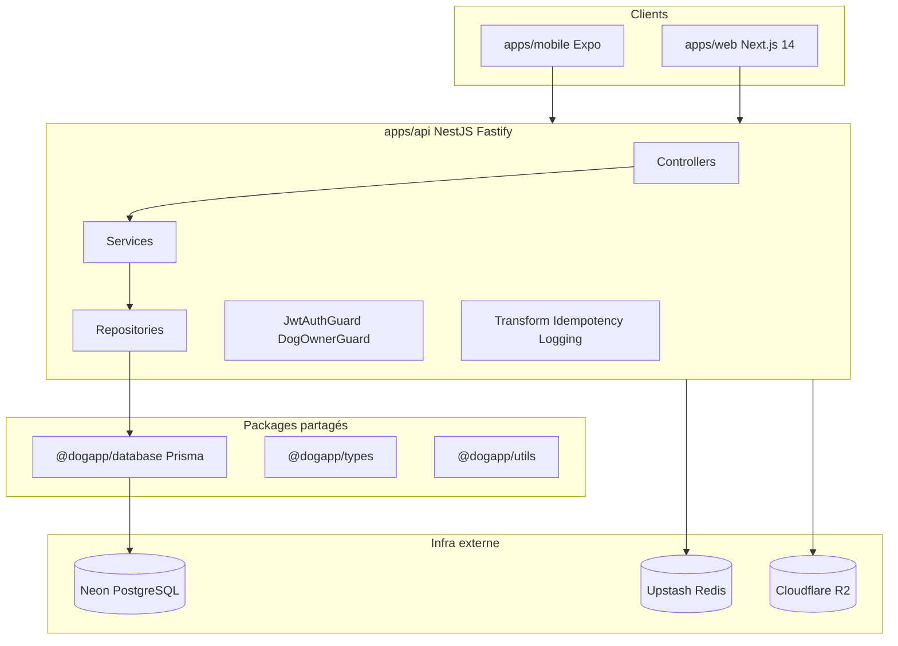

# Plan de développement DogApp — démarrage progressif

## État actuel

| Élément                    | Statut                                                                                                                                          |
| -------------------------- | ----------------------------------------------------------------------------------------------------------------------------------------------- |
| Code applicatif            | **Absent** — seuls [`CLAUDE.md`](CLAUDE.md) et [`DogApp_Specs/`](DogApp_Specs/)                                                                 |
| Git                        | Initialisé, **aucun commit**                                                                                                                    |
| Référence d’implémentation | [`DogApp_Specs/05_plan_developpement.md`](DogApp_Specs/05_plan_developpement.md) (priorité absolue)                                             |
| Périmètre MVP              | Lot 1 dans [`DogApp_Specs/03_lots_mvp_et_full.md`](DogApp_Specs/03_lots_mvp_et_full.md) : F01–F05, F08, F10, F12 + socle auth/users/dogs/notifs |

**Règle directrice :** ne pas entamer l’étape N+1 tant que l’étape N n’est pas terminée, testée et CI verte (§16 + Definition of Done §18).

---

## Architecture cible (rappel)



Pattern obligatoire par module : **Controller → Service → Repository** — jamais de Prisma dans le service ni de logique métier dans le controller ([§4 du plan](DogApp_Specs/05_plan_developpement.md)).

---

## Phase 0 — Prérequis infrastructure (avant le code)

Comme les comptes ne sont pas encore créés, traiter cela comme **sous-étape 0.0** bloquante pour la DB et les jobs :

1. **Neon** — projet `dogapp`, branches `main` (prod), `staging`, `dev/<votre-nom>` ; noter `DATABASE_URL` (poolé) et `DATABASE_URL_UNPOOLED` (migrations uniquement).
2. **Upstash** — base Redis serverless par environnement ; noter URL + token REST (BullMQ + idempotence).
3. **Cloudflare R2** — bucket `dogapp-dev` ; clés API S3-compatibles ; pas d’URL publique permanente (presigned uniquement, §11).
4. **Secrets locaux** — copier le template §14 du plan vers :
   - `apps/api/.env`
   - `apps/web/.env.local`
   - `apps/mobile/.env.local`  
     Fichier racine [`.env.example`](.env.example) versionné, jamais de vraies valeurs commitées.
5. **JWT** — générer `JWT_SECRET` ≥ 32 caractères aléatoires.

**Livrable 0.0 :** `.env` locaux remplis + connexion Neon testée (`pnpm db:push` une fois le package database créé).

---

## Phase 0.1 — Monorepo et tooling (PR 1)

Créer la structure décrite en [§1](DogApp_Specs/05_plan_developpement.md) :

```
applikav3/
├── apps/api/
├── apps/mobile/
├── apps/web/
├── packages/database/
├── packages/types/
├── packages/utils/
├── pnpm-workspace.yaml
├── turbo.json
├── package.json
├── tsconfig.base.json
├── .nvmrc              # Node 22 LTS
├── .env.example
├── .gitignore
└── .github/
```

**Contenu minimal par package :**

| Package            | Rôle initial                                                                                                                                 |
| ------------------ | -------------------------------------------------------------------------------------------------------------------------------------------- |
| `@dogapp/types`    | `AuthUser`, `ApiResponse`, `PaginatedMeta`, enums (`ReminderType`, `UserRole`, etc.) — [structure §1](DogApp_Specs/05_plan_developpement.md) |
| `@dogapp/utils`    | `toSnakeCase` / `toCamelCase` récursifs (§6)                                                                                                 |
| `@dogapp/database` | export `PrismaClient` singleton avec adapter Neon (§5)                                                                                       |

**Tooling root :** ESLint strict (`@typescript-eslint/recommended-type-checked`), Prettier, Husky + lint-staged, commitlint (Conventional Commits), scripts Turbo : `dev`, `build`, `test`, `lint`, `typecheck`, `db:*`.

**Apps squelettes (pour `pnpm dev`) :**

- `apps/api` : placeholder `main.ts` vide ou healthcheck
- `apps/mobile` : Expo Router avec `(auth)/login` stub + `(tabs)/index` stub
- `apps/web` : Next.js 14 App Router avec page d’accueil stub

**Design tokens (mobile/web) :** amorcer les variables depuis [`04_design_book.md`](DogApp_Specs/04_design_book.md) — corail `#FF6340`, fond `#FAFAF8`, texte `#1A1A2E` (NativeWind + Tailwind), sans implémenter encore les écrans métier.

**Livrable :** `pnpm install && pnpm lint && pnpm typecheck` passent ; premier commit `chore(infra): init monorepo pnpm turbo`.

---

## Phase 0.2 — Base de données Prisma (PR 2)

Fichier source : [`packages/database/prisma/schema.prisma`](packages/database/prisma/schema.prisma)

Dériver **toutes** les tables du schéma SQL dans [`02_specs_techniques_architecture.md` §4](DogApp_Specs/02_specs_techniques_architecture.md) avec les règles Prisma du plan :

- `id String @id @default(cuid())` sur chaque modèle
- `createdAt` / `updatedAt` partout
- `deletedAt DateTime?` sur les entités santé (soft delete)
- `@@map("snake_case")` + index sur FK et champs filtrés
- Relations typées des deux côtés

**Modèles MVP prioritaires (étape 0) :** `User`, `RefreshToken`, `Dog`, `FeatureFlag`, `AuditLog`, `Attachment`, plus tables santé vides pour migration unique : `HealthRecord`, `Reminder`, `SymptomLog`, `Medication`, `MedicationDoseLog`, `WeightLog`, `HygieneCare`, `CheckupResult`, `FavoriteVet`, `DeviceToken`, `IdempotencyKey` (ou cache Redis selon implémentation intercepteur).

**Seed** [`packages/database/prisma/seed.ts`](packages/database/prisma/seed.ts) :

- Races courantes + référentiel poids (F05)
- `FeatureFlag` : `pedigree`, `reproduction`, `social` → `false`
- Questions check-up F12 (si modèle dédié)

**Commandes :** `db:generate` → `db:migrate` (nom `init`) sur branche Neon `dev`.

**Livrable :** schéma appliqué sur Neon dev ; `pnpm db:studio` fonctionne.

---

## Phase 0.3 — Backend NestJS socle (PR 3)

Initialiser [`apps/api`](apps/api) avec **Fastify** (pas Express), préfixe global `/api/v1`.

**Module `common/`** (templates §4–6) :

| Composant     | Fichiers clés                                                                                          |
| ------------- | ------------------------------------------------------------------------------------------------------ |
| Prisma        | `PrismaService` global depuis `@dogapp/database`                                                       |
| Config        | `ConfigModule` + validation Zod des env                                                                |
| Intercepteurs | `TransformInterceptor` (`{ data, meta }` + snake_case), `LoggingInterceptor`, `IdempotencyInterceptor` |
| Filtres       | `HttpExceptionFilter` (RFC 7807), `PrismaExceptionFilter`                                              |
| DTO           | `PaginationQueryDto` (cursor, limit 1–100)                                                             |
| Décorateurs   | `@CurrentUser()`, `@Idempotent()`                                                                      |

**Modules infrastructure :**

- BullMQ + Upstash (queue notifications, jobs rappels — module vide au début)
- R2 : service presigned upload/read (TTL 5 min upload, 1h lecture)
- Swagger : `/api/docs` (OpenAPI 3.1)

**Tests (≥ 80 % sur common) :** guards/intercepteurs/filtres avec mocks — pas d’appels réseau réels.

**Livrable :** `GET /api/v1/health` (ou équivalent) + Swagger ; CI lint/typecheck/test sur PR.

---

## Phase 0.4 — Authentification (PR 4)

Module [`apps/api/src/auth/`](apps/api/src/auth/) :

| Endpoint                | Comportement           |
| ----------------------- | ---------------------- |
| `POST /auth/register`   | User + tokens          |
| `POST /auth/login`      | bcrypt cost 12         |
| `POST /auth/refresh`    | rotation refresh token |
| `POST /auth/logout`     | révocation token       |
| `POST /auth/revoke-all` | tous appareils         |

- `JwtAuthGuard`, `JwtRefreshGuard`
- Table `RefreshToken` (hash bcrypt du token opaque)
- Cron nettoyage tokens expirés
- Révocation globale si refresh révoqué réutilisé (§7)

**OAuth Google (MVP lot 1 socle) :** reporter après email/password stable — non listé en §0.4 du plan.

**Tests :** unitaires service + intégration routes (Supertest, DB mockée ou test DB Neon éphémère).

---

## Phase 0.5 — Users (PR 5)

Module [`apps/api/src/users/`](apps/api/src/users/) :

- `GET /account/me`, `PATCH /account/me`
- `DELETE /account` (soft delete + purge planifiée)
- `GET /account/export` (JSON/ZIP stub acceptable en v1)
- Avatar : flow R2 presigned → confirm

---

## Phase 0.6 — Dogs (PR 6)

Module [`apps/api/src/dogs/`](apps/api/src/dogs/) :

- CRUD : `GET/POST /dogs`, `GET/PATCH/DELETE /dogs/:id`
- **`DogOwnerGuard` obligatoire** sur toute route `/:dogId`
- Photo chien via R2

**Tests critiques :** 403 si `dogId` n’appartient pas au user connecté.

---

## Phase 0.7 — CI/CD de base (PR 7)

[`.github/workflows/ci.yml`](.github/workflows/ci.yml) selon §15 :

- Sur chaque PR : lint, typecheck, tests, coverage services
- Dockerfile API (build seulement en 0.7 ; deploy staging quand branche `staging` existe)
- Template PR [`.github/pull_request_template.md`](.github/pull_request_template.md) avec checklist DoD §18

**Livrable fin Phase 0 :** parcours manuel ou test E2E minimal : register → login → create dog → list dogs.

---

## Phase 1 — Santé core MVP (semaines 3–5)

Pour **chaque feature**, ordre strict : **Backend → Mobile → Web → Tests** (§16). Ne pas paralléliser deux features backend sans finir la précédente.

| Ordre | Feature        | Modules backend               | Points critiques                                         |
| ----- | -------------- | ----------------------------- | -------------------------------------------------------- |
| 1.1   | F01 Carnet     | `health/records`, attachments | AuditLog, pagination cursor, swipe delete mobile         |
| 1.2   | F02 Rappels    | `health/reminders`            | BullMQ J-30/14/7/1, `@Idempotent()` sur `PATCH .../done` |
| 1.3   | F03 Symptômes  | `health/symptoms`             | Photo optionnelle R2                                     |
| 1.4   | F04 Médication | `health/medications`          | `MedicationDoseLog`, stock faible, idempotence prise     |
| 1.5   | F05 Poids      | `tracking/weight`             | Idempotence `POST /weight`, plages race/âge              |
| 1.6   | F08 Hygiène    | `tracking/hygiene`            | `nextDueAt`, jobs rappels                                |
| 1.7   | F10 Vétos      | `vets`                        | Google Places + cache Redis 24h, `FavoriteVet`           |
| 1.8   | F12 Check-up   | `checkup`                     | Score, questionnaire adapté à l’âge                      |
| 1.9   | Notifs push    | `notifications`               | `DeviceToken`, Expo, nettoyage tokens invalides          |

**Clients — patterns à respecter :**

- Mobile : Expo Router, React Query (`queryKey: [feature, dogId, ...]`), Zustand sans API, touch targets ≥ 44px, états vide/loading/erreur ([§8](DogApp_Specs/05_plan_developpement.md))
- Web : Server Components par défaut ; portail `/share/[token]` = **Lot 2** (F13)
- Palette : [`04_design_book.md`](DogApp_Specs/04_design_book.md) — pas de dark mode v1

**5 parcours E2E prioritaires** (§12) — à automatiser au fil de l’eau :

1. Inscription → chien → rappel → notif → effectué
2. Médicament → prise → historique
3. Symptômes → check-up → vétos
4. Pesée → courbe → alerte hors plage
5. Partage vétérinaire (Lot 2)

---

## Phase 2 — Enrichi (après MVP validé)

Référence [`03_lots_mvp_et_full.md` §4](DogApp_Specs/03_lots_mvp_et_full.md) : F06 Nutrition, F07 Activité, F13 Partage vétérinaire (portail public Next.js), dashboard web, i18n, RGPD export/delete complets.

---

## Phase 3 — Complet

F09 Pedigree, F11 Reproduction (`FeatureFlagGuard`), F14 Social, Stripe — derrière feature flags en DB.

---

## Stratégie d’exécution (comment je procéderai)

1. **Une PR = un sous-lot cohérent** (0.1 → 0.7, puis 1.1, 1.2…) pour revue et CI courtes.
2. **Tests en même temps que le code** — pas de merge si coverage service &lt; 80 %.
3. **Checklist systématique** avant chaque merge (§17 + [`CLAUDE.md`](CLAUDE.md)) : `DogOwnerGuard`, format `{ data, meta }`, pas de `any`/`as`/`!`.
4. **Premier commit** après 0.1 pour figer le monorepo ; push sur branche `dev/foundations` recommandé.

---

## Risques et mitigations

| Risque                           | Mitigation                                                                  |
| -------------------------------- | --------------------------------------------------------------------------- |
| Schéma Prisma incomplet vs specs | Valider la liste des modèles contre §4 de `02_specs` avant migration `init` |
| Scale-to-zero Neon en dev        | Acceptable en dev ; documenter passage Pro pour prod (specs §2)             |
| OAuth Google demandé en MVP      | Phase 1.10 ou Lot 2 — après auth email stable                               |
| Scope creep (F06–F14)            | Feature flags + ordre §16 strict                                            |

---

## Critère de passage Phase 0 → Phase 1

- [ ] Monorepo buildable (`pnpm build`)
- [ ] Migration Prisma sur Neon dev
- [ ] Auth + Users + Dogs opérationnels avec tests
- [ ] `DogOwnerGuard` testé (403 cross-user)
- [ ] Swagger à jour sur `/api/docs`
- [ ] CI verte sur la PR foundations
